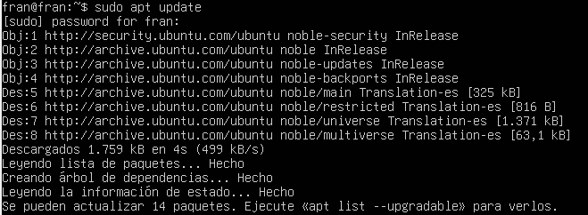
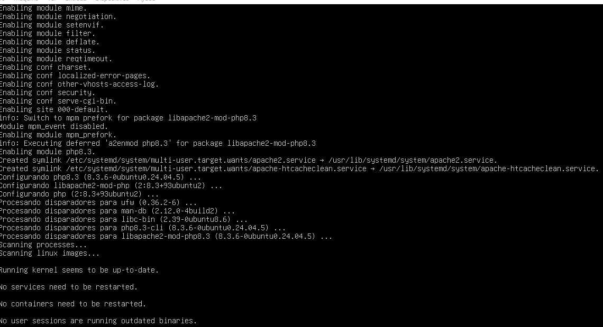
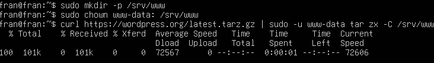
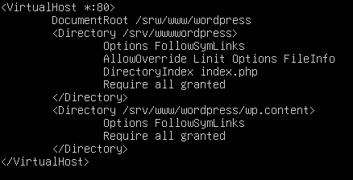

# Instalación SGE

### Una vez que el ubuntu server esta instalado comenzaremos a configurar e instalar diferentes aspectos. 

#### 1. Instalar dependencias.
   Primeramente instalaremos PHP y Apache del siguiente modo:
   - El primer paso antes de instalar el software nuevo es el sudo apt update que actualiza la lista de paquetes disponibles en los repositorios de Ubuntu.
     
     
     
   - Por otro lado con los otros comandos instalamos los componentes basicos para ejecutar WordPress.
      - apache2 → Servidor web donde correrá WordPress.
      - mysql-server → Sistema de gestión de bases de datos donde se almacenará la información.
      - php → Lenguaje de programación necesario para ejecutar WordPress.
      - libapache2-mod-php → Módulo que permite a Apache procesar archivos PHP.
      - php-mysql → Extensión de PHP para conectar con MySQL. La opción -y confirma automáticamente la instalación sin pedir confirmación al usuario.
        
 

   

#### 2. Instalar WordPress
   Una vez que hemos instalado las dependencias procederemos a instalar el WordPress.
   
  - Para ello primero  creamos el directorio donde se asigna como propietario de la carpeta /srv/www al usuario y grupo www-data, que es el usuario por defecto que usa Apache para ejecutar procesos web.
  - Luego descargamos la última version de WordPress en un archivo comprimido y descargamos WordPress directamente, evitando problemas de permisos.
   
  
  
#### 3. Configurar apache para WordPress

   Una vez instalado el WordPress tenemos que configurar dicho WordPress para Apache:
   - Para eso es necesario crear un archivo Apache para WordPress y configurar los diferentes sitios y habilitar los módulos necesarios para completar el proceso.
      
  

#### 4. Configurar la base de datos
Para configurar WordPress, necesitamos crear una base de datos MySQL:

#### 5. Configurar WordPress para la base de datos
  
#### 6. Configurar WordPress
